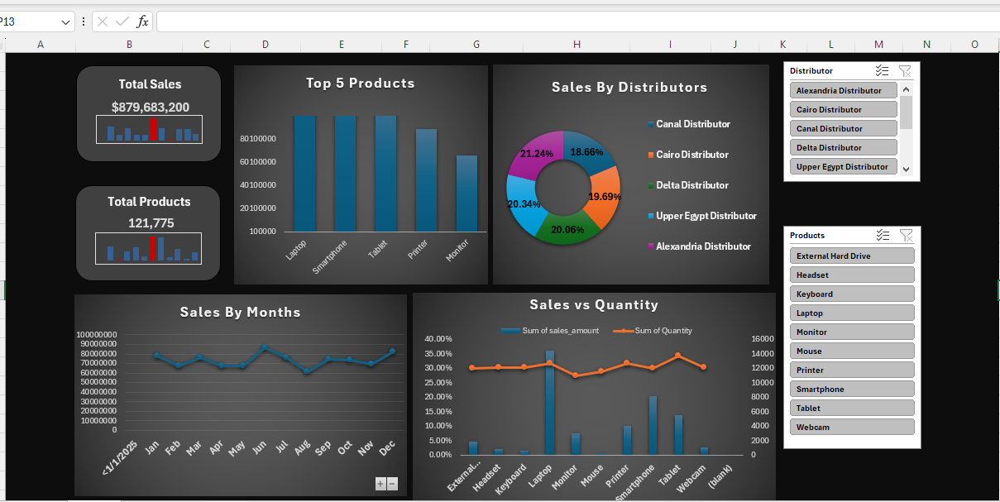
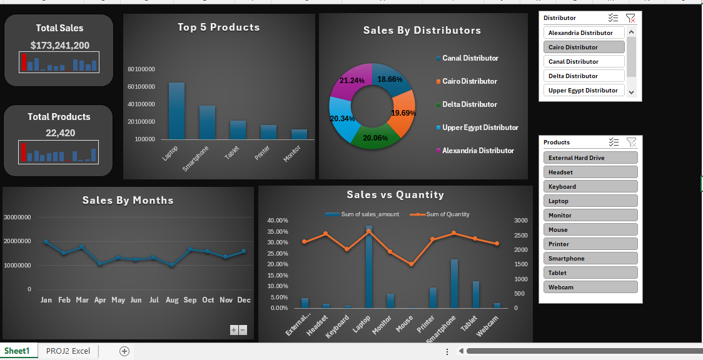
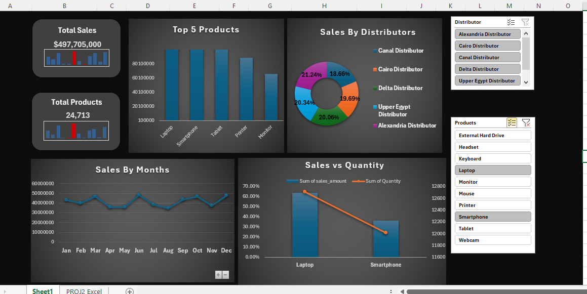
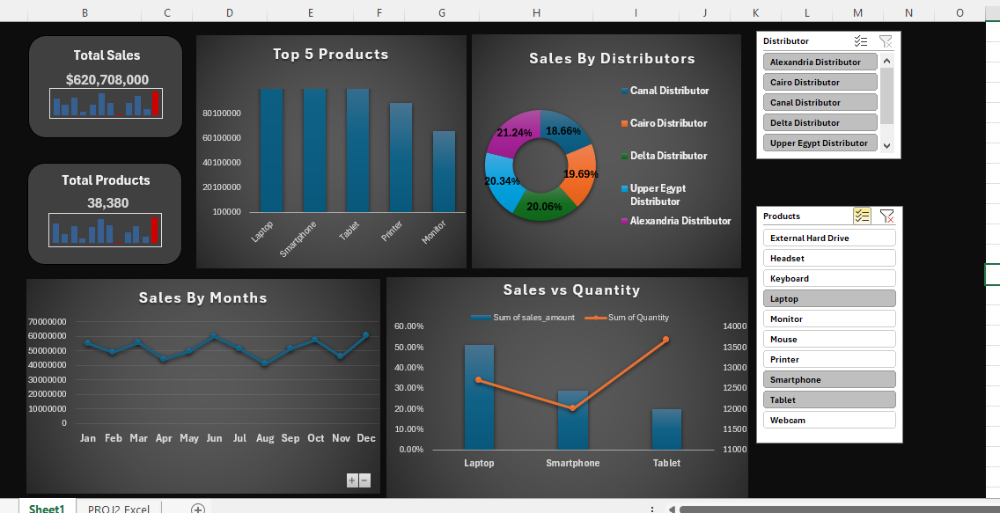

# Sales Analysis & Excel Dashboard

## Project Overview

This project presents a sales data analysis workflow built using Microsoft Excel.

The project started with data distributed across five sheets. The sheets were combined and transformed using Power Query, followed by data analysis using Pivot Tables and the development of an interactive Excel dashboard.

## Workflow

1. Data preparation
2. Combining and transforming the five sheets using Power Query
3. Data analysis
4. Creating Pivot Tables
5. Building an interactive Excel Dashboard

## Tools Used

* Microsoft Excel
* Power Query
* Pivot Tables
* Python for data generation
* Slicer

## Project Structure

The main deliverable is the Excel workbook:

`Sales_Analysis_Dashboard.xlsx`

The workbook contains the prepared data, analysis, Pivot Tables, and final dashboard.

## Key Skills Demonstrated

* Data preparation and transformation
* Power Query
* Data analysis
* Pivot Tables
* Excel dashboard development
* Working with data from multiple sheets

